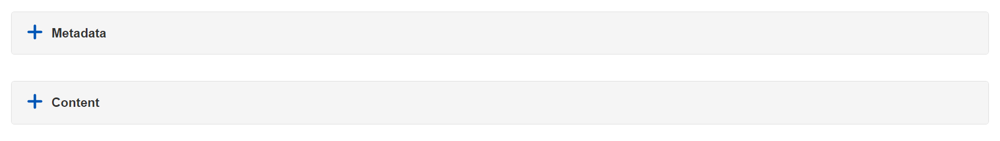
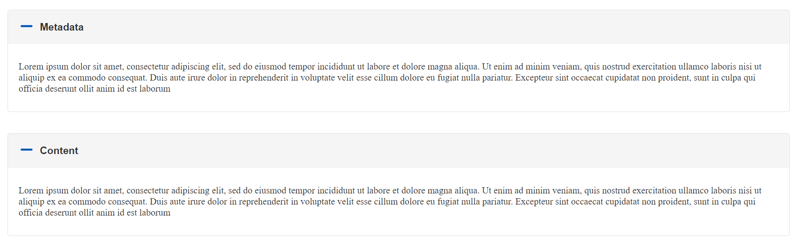
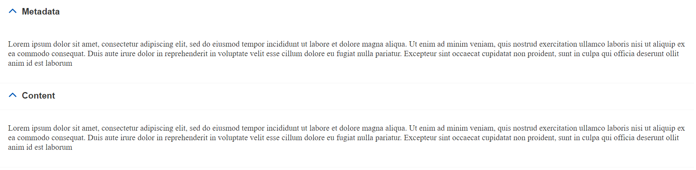

# React Reusable Accordion Component

This project is developed for Wiley VQA and is designed to be reusable and customizable for future purposes. The component includes two primary design variants that can be easily implemented using the variant property.

## Features

- **Reusable**: Designed with flexibility to be incorporated into different projects.
- **Customizable**: Easily modify properties to fit specific design requirements.
- **Multiple Variants**: Includes alternative and default design options for varied user experiences.


## Usage Instructions

### Alternative Design

To use the **alternative** design, specify the variant property as alternative as shown below:

```angular2html
<Accordion items={accordionItems} allowMultipleOpen={true} variant='alternative'/>
```





### Default Design

To use the **default** design, specify the variant property as default as shown below:

```angular2html
<Accordion items={accordionItems} allowMultipleOpen={true} variant='default'/>
```




## Customization

You can modify the following properties:

- **items**: An array of accordion items to be displayed.
- **allowMultipleOpen**: A boolean to control whether multiple items can be expanded simultaneously.
- **variant**: The design type, either alternative or default.